eCommerceGAN : A Generative Adversarial Network for E-commerce [paper](https://arxiv.org/abs/1801.03244)
```
@article{DBLP:journals/corr/abs-1801-03244,
  author    = {Ashutosh Kumar and
               Arijit Biswas and
               Subhajit Sanyal},
  title     = {eCommerceGAN : {A} Generative Adversarial Network for E-commerce},
  journal   = {CoRR},
  volume    = {abs/1801.03244},
  year      = {2018},
  url       = {http://arxiv.org/abs/1801.03244},
  archivePrefix = {arXiv},
  eprint    = {1801.03244},
  timestamp = {Thu, 01 Feb 2018 19:52:26 +0100},
  biburl    = {https://dblp.org/rec/bib/journals/corr/abs-1801-03244},
  bibsource = {dblp computer science bibliography, https://dblp.org}
}
```

# E-commerce GAN
1. 한 줄 요약: 주문 데이터(물품명, 설명, 구매자, 가격, 일자 등)을 저차원의 벡터로 변환하여 GAN을 통하여 그럴듯 하다고 생각되는 주문 데이터를 생성해 낼 수 있다는 것을 적당한 통계적인 수치와 비교를 통하여 보인다.
	1. e-commerce 의 주문을 밀집된 저차원의 벡터(dense and low-dimensional vector)로 변환
	1. ecommerceGAN(ecGAN) 학습: GAN을 통하여 그럴듯한 주문을 생성해 낼 수 있다.
	1. ecommerce-conditional-GAN(ec2GAN) 학습: 특정 조건(상품에 대한)을 가지는 주문을 생성해 낼 수 있다.

## GAN 기초지식
1. Genrative Adversarial Network 설명
1. Deep Convolutional GAN(DCGAN) 설명
1. Wassertein GAN(WGAN) 설명

## 주문 데이터 표현
1. 주문 데이터: 주문은 {customer, product, price, date}로 구성되어 있고 각각을 다른 방법으로 아래와 같이 벡터화 한다.
	1. product embedding: 모든 단어를 word2vec을 통하여 벡터로 변환한 뒤에 이들을 가중 평균(weighted average)을 낸다.
		1. 임의로 선택한 1.43억 물품들의 제목과 물품 설명으로부터 word2vec 모델을 학습한다.
		1. 같은 corpus로부터 각 단어의 IDF(inverse document frequency) 값을 구한다.
		1. sum(word2vec(word) * IDF(word) for all word in title)
		1. 결과 벡터는 128 차원이고 각 스칼라 값은 -1~1 사이의 값을 가진다.
	1. customer embedding: 각각의 고객을 벡터에 embedding하기 위하여, Discriminative Multi-task Recurrent Neural Network(RNN)을 학습시킨다. 
		1. <p align="center">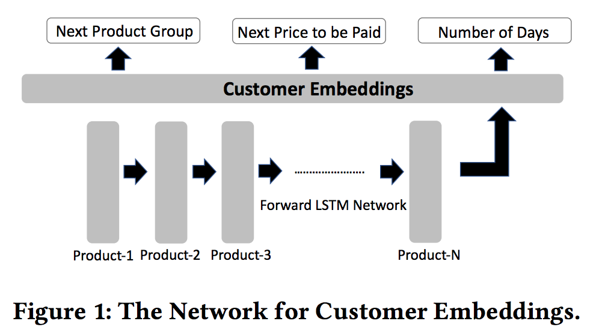</p>
		1. 학습할 목표(multi-class classification task)
			1. 구매할 다음 물품 그룹명(clothes, food, furniture, baby-products etc.)
			1. 구매 가격
			1. 다음 구매까지의 경과일
		1. RNN with LSTM cells
		1. input layer: the sequence of products(product embedding을 통하여 얻은 벡터값)
		1. hidden layer: hidden representation(customer embedding으로 봄). 비슷한 물품 구매 시계열을 갖는 고객이 비슷한 값에 embedding 시킴
		1. 학습: 각 iteration에서 임의의 task(물품 그룹, 구매 가격, 다음 구매 경과일)를 선택하여 학습시킴
		1. 결과 벡터는 128 차원이고 각 스칼라 값은 -1~1 사이의 값을 가진다.
	1. price: 큰 가격의 효과를 줄이기 위하여 log변환을 취하여 -1~1 사이의 값으로 변환한다.
	1. date of purchase: 7차원 벡터로 표현한다.
		1. The first component captures the difference between the current date and a pre-decided epoch
		1. 다음 2개의 컴포넌트는 day of the month
		1. 다음 2개의 컴포넌트는 월을 표현한다.
		1. 일자와 월의 circularity을 확보하기 위하여 [unit circle](https://en.wikipedia.org/wiki/Unit_circle) 위에 값을 표현 x = (sin(t), cos(t))
		<p align="center"></p>
		1. 각각의 feature들은 -1 ~ 1로 정규화한다.
	1. 최종 벡터는 128 + 128 + 1 + 7 = 264 차원 벡터로 표현
		1. 128 차원 고객 벡터
		1. 128 차원 제품 벡터
		1. 1차원 가격벡터
		1. 7차원 구매 날짜 벡터

## ecGAN
1. an order 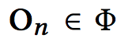는 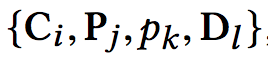의 tuple이다.
	- 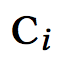: i-th customer
	- 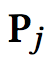: j-th product
	- 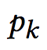: price of product
	- 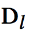: date vector
1. discriminator: 실제 order와 generator가 생성해내는 order를 구분해내도록 학습한다.
	1. 구조: fully connected layer with two hidden layer, 각 layer의 마지막에는 ReLU activation함수 추가.
1. generator: distriminator가 실제 order와 구분해내짐 못하도록 가짜 order를 생성해낸다.
	1. 구조: fully connected layer with two hidden layer, 각 layer의 마지막에는 ReLU activation함수 추가.
	1. maps the noise vectors(z) to feasible orders(On~)

## ec2GAN
1. <p align="center">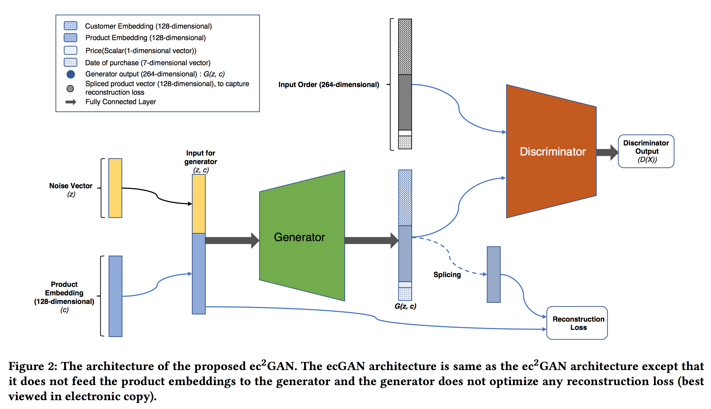</p>
1. generator에 입력으로 들어가는 noise vector(z)에 제품 벡터(Pj)가 추가됨. z' = [z, ] 이를 통하여 테스트할 때 원하는 제품에 대한 실현가능한 주문(feasible order)을 생성해 낼 수 있다.
1. generation loss에 reconstruction loss J(R)를 추가했다.
	1. 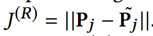, generator에 입력으로 들어가는 제품 벡터와 생성된 제품 벡터의 Euclidean distance
	1. ec2GAN의 loss는 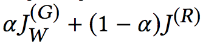, 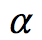는 튜닝 파라미터

## ec2GAN의 활용
1. <p align="center">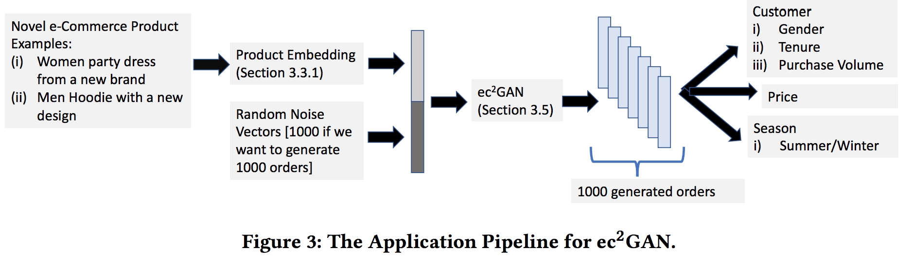</p>
	1. 제품의 embedding 벡터를 구한다.
	1. 제품의 embedding 벡터와 노이즈벡터를 결합하여 ec2GAN에 넣는다. 1,000개의 주문 데이터를 생성하기 위하여 1,000개의 랜덤 노이즈 벡터를 ec2GAN에 입력하면, 서로 다른 1,000개의 주문 데이터가 생성된다.
	1. 생성된 주문데이터를 분류하여 고객의 성향(성별, 기간, 구매크기), 가격, 계절적인 구매수요 등을 찾아낼 수 있다.

## 실험
1. 데이터셋
	1. 지난 1년간 주문 중 임의로 선정한 5백만 주문데이터 {customer, product, price, date}
1. 알아낸 사실들
	1. discriminator와 generator의 hidden layer의 개수를 조정하면서 실험을 해 보았는데, 2개의 hidden layer가 가장 좋았다.
	1. 노이즈 벡터의 차원을 {32, 64, 96, 128}로 테스트 해 보았는데, 96차원의 노이즈 벡터가 가장 안정적이고 정확한 모형을 학습할 수 있었다.
	1. Logistic Regression으로 실제 주문과 GAN이 생성해 낸 주문을 구분하게 해 보았는데, 정확도가 50%를 보였다.
	1. ecGAN, ec2GAN의 세부 파라미터
		1. <p align="center">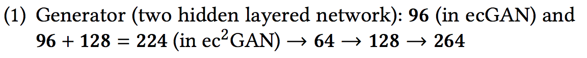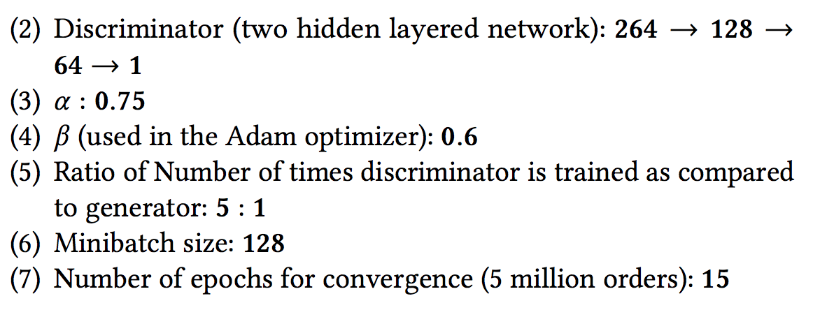</p> 
		1. Generator(2개의 hidden layer): 96(ecGAN), 96+128=224(ec2GAN) -> 64 -> 128 -> 264
		1. Discriminator(2개의 hidden layer): 264 -> 128 -> 64 -> 1
		1. alpha: 0.75
		1. beta(adam optimizer): 0.6
		1. discriminator와 generator가 학습된 횟수의비율 = 5 : 1
		1. Minibatch 크기: 128
		1. (5백만 주문데이터가) 수렴하기까지의 epoch수: 15
1. ecGAN qualitative analysis: 사진이나 음악과 다르게 주문데이터가 그럴듯하게 생성되었는지는 감각에 의하여 확인할 수 없기 때문에 다음과 같이 3가지 방법으로 간접적으로 확인하였다.
	1. t-SNE: 차원축소를 해서 보니 비슷해 보인다.
	<p align="center">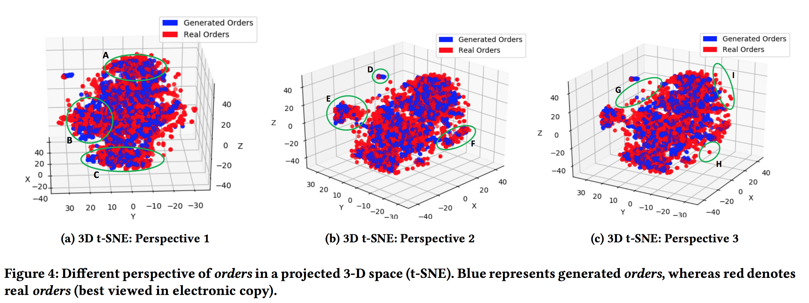</p> 
	1. feature correlation: 각 주문은 264개의 feature가 있는데, 임의의 3개의 feature {f1, f2, f3} 을 선택하여 실제 데이터에서 corr(f1, f2) > corr(f1, f3) 인 경우 GAN에 의하여 생성된 데이터도 동일한 feature에 대하여 corr(f1, f2) > corr(f1, f3)인지 확인하였다. 임의의 100K개의 {f1, f2, f3}를 선택하였을 때 correlation이 일치하는 비율이 77%를 보여 그럴듯한 데이터를 생성한 것으로 보인다(baseline 방법은 50%가 일치).
	1. data distribution in random forest leaves: 가짜와 진짜 주문을 구분하는 random forest 모형을 학습.
		1. random forest: 100개의 tree, maximum depth 5(각 tree의 leaf node는 32개)
		1. 각 leaf 노드에서 'real-order-ratio'를 구하여 분포를 그려봄
		<p align="center"></p>
		1. 분포의 중심이 0.57이므로 가짜 데이터가 그럴듯해 보인다.
1. ec2GAN quantitative analysis
	1. GAN을 수치적으로 평가(quantitative evaluate)하는 것은 어렵다. 우리가 설계한 평가 방법을 finance, transportation, health-care, sports 등의 영역에도 비슷하게 적용할 수 있다. ec2GAN에는 노이즈와 함께 제품의 embedding 벡터가 generator에 들어가기 때문에 신상품이 나왔을 때, 이에 대한 고객의 반응을 예측하는데 활용할 수 있다. Relative Similarity Measure(RSM): quantitatively compare the generated orders and the real orders with respect to each characteristic. ec2GAN을 Conditional Variational Autoencoder(C-VAE)와 비교해 보겠다.
	1. Baseline Order Generation Approach: C-VAE를 baseline으로 사용하겠다.
	1. Relative Similarity Measure(RSM): 아래 계층구조의 leaf node에 대하여 propensity score 를 계산한다. 이를 통하여 임의의 두 제품 pi, pj에 대하여 sti >= stj and sgi >= sgj 와 같이 일치를 보이는 주문들을 측정한다. 임의의 N개의 샘플쌍(10,000)에 대하여 실제와 생성한 주문 사이에 일치가 얼마나 있는지 확인해 보았다.
		1. 논문에서 가정하는 계층구조
			- Customer
				- Gender
					* Female
					* Male
				- Tenure
					* High-tenured(more than five years)
					* Medium-tenured(between two and five years)
				- Purchase Volume
					* High Purchasers
					* Average Purchasers
			- Price
			- Seasonal Demand
				- Summer(May, June, July, August)
				- Winter(November, December, January, February)
		1. Customer Characterization: 새로운 제품을 출시할 때, ec2GAN을 통하여 주문 데이터를 생성해낼 수 있기 때문에 이를 통하여 타겟이 되는 고객의 gender, age, tenure, purchase volume 등을 분석해 낼 수 있음.
			1. 내부 설문이나 과거 데이터를 통하여 gender, age, tenure, purchase volume 등을 예측하는 모델을 학습시킨다. 예시) 성별을 구분하는 분류기를 만든다.
			1. 제품 pi에 대하여, 지난 1년간의 구매기록을 가져와 누가 해당 제품을 구매했는지 파악한다. 예시) 이렇게 얻은 고객들({Ci})을 1번에서 생성한 분류기에 넣어서 성별 비율을 구한다. sti
			1. 각 제품 pi의 embedding 벡터를 ec2GAN에 넣어서 1,000개의 고객을 생성해낸다. {C~i} 이 고객들 또한 1번의 분류기에 넣어서 성별 비율을 구한다. sgi
			1. Propensity score sti와 sgi를 성별 특징에 해당하는 RSM점수를 구할 떄 사용한다.
			1. RSM점수를 구하면, 여성에 대하여 81.08%, 남성에 대하여 82.20%가 나온다. 
			ec2GAN이 효과적으로 주문을 생성해냄을 확인하였다.
			<p align="center">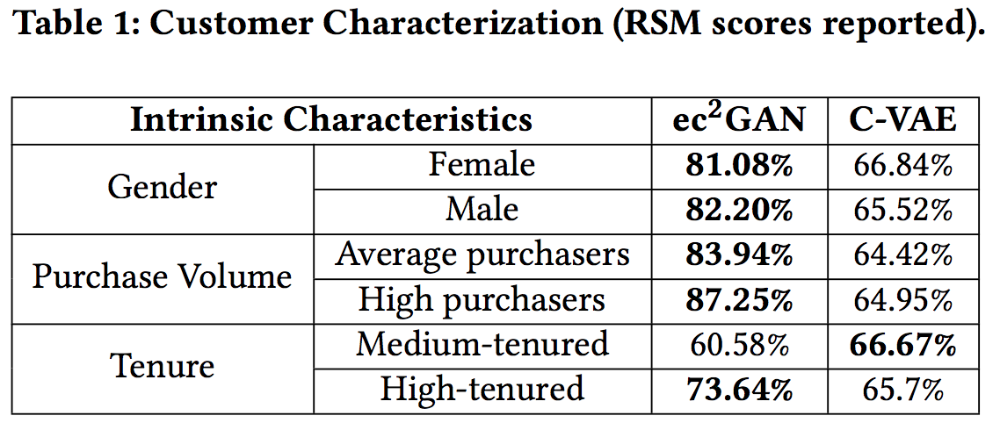</p>
		1. Price Characterization: 새로운 제품을 출시할 때 가격산출이 중요하다.
		<p align="center">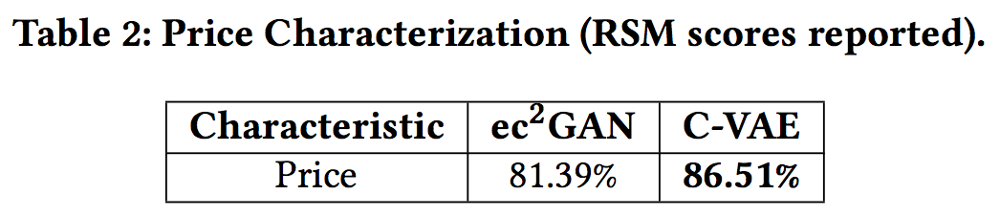</p>
		1. Seasonal Demand Characterization
		<p align="center">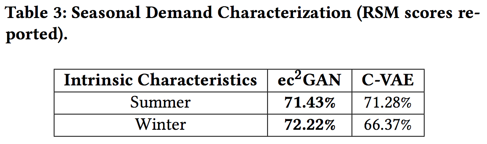</p>
		1. Discussion 
	1. ec2GAN: Distribution Comparison
		1. <p align="center">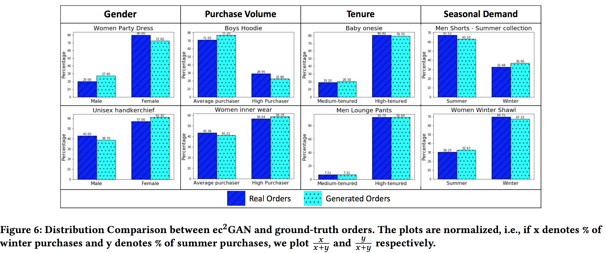</p>